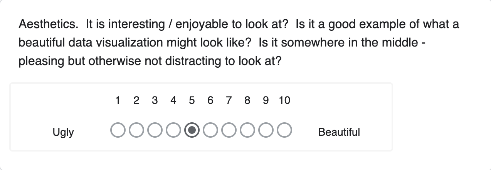

| [Home Page](https://sharvariyeole.github.io/portfolio) | [Visualizing Debt](visualizing-government-debt) | [Critique by Design](critique-by-design) | [Final Project I](final-project-part-one) | [Final Project II](final-project-part-two) | [Final Project III](final-project-part-three) |

# Critique by Design

## Step one : Choose a data visualization from MakeoverMonday

I recently had the opportunity to read about Cynthia Carroll, she served as the Chief Executive Officer of Anglo American PLC, one of the world's largest mining companies, from 2007 to 2013 During her tenure, she made notable changes, focusing on improving safety standards, which led to a substantial reduction in fatalities and injuries in the company's operations Her leadership was marked by a strong emphasis on ethical practices and corporate social responsibility, seeking to enhance the company's environmental and social impact

I also watched a movie named Mission Raniganj based  on the incident of the Raniganj Coalfields Collapse of 1989 which happened in West Bengal. It depicts the biography Jaswant Singh Gill who saved the lives of many miners after the collapse. 

While I was browsing through the MakeoverMonday website I came across this article titled "Indian Coal Mine Location and Production" which intrigued me.

The article is published [here](https://iopscience.iop.org/article/10.1088/2633-1357/abdbbb)

While reading the article I came across the following chart :

Based on what I've learned in this course about evaluating visualizations, I noticed numerous issues with the chart that made it difficult to understand.

The chart is cluttered with closely packed horizontal bars, making it difficult to distinguish between districts, and the dual-axis presentation could lead to confusion 

## Step two: Critique the Data Visualization

### Usefulness

- The graph depicts coal production and the number of mines in different districts throughout 12 states. 
- It is quite beneficial as it disseminates data that academics, environmental analysts, policy makers, and coal industry stakeholders may find 
   useful.
- It displays the relationship between the quantity of mines and output levels, which is relevant for planning and resource management.

### Completeness
 
    
- The graph has basic components such as labels, a legend, and a title that provides context. 
- However, it may be improved by include a date range for the data, coal output units (assuming metric tonnes, MT).

### Perceptibility

- The reader can comprehend the material, but it may take more work than necessary.
- While the horizontal bar graph is an appropriate option for this data type, the visualisation is thick and congested, making it impossible to 
  compare closely spaced districts.
- Furthermore, the colour scheme for the number of mines (blue) and coal production (orange) is not troublesome; nevertheless, the strength of 
  the colours may be modified for clarity.

### Truthfulness
 

 - Assuming that the data is properly obtained and presented, the graph looks to be correct.
 - There is no clear manipulation of the scales or data that may result in deception.
 - The graph clearly shows the number of mines and coal output.

### Intuitiveness

- The dual-axis bar graph is quite straightforward, but it may benefit from a quick explanation on how to understand it, particularly for an audience unfamiliar with dual-axis charts.
- Furthermore, some bars are too near to one other, which might be confused without a closer look.

  
### Aesthetics

- The graph is practical but not especially visually appealing.
- The colour choice is simple, and the overall design is practical.
- It's not a particularly attractive example of data visualisation, but it doesn't detract from the information being provided.

### Engagement

- The graph shows the data in a simple manner, but it does not interest the audience beyond the basic facts.
- It does not convey a tale or give insights that may pique someone's interest in the subject or encourage sharing or conversation.

### Overall Observations

- The graph stands out as a functional depiction of coal output and mine count data, but it is difficult to interpret due to its density and lack of spacing.
- The dual-axis bar graph is effective for displaying two different units of measurement; however, improved visual separation and data labelling might increase readability.
 
### Who is the Primary Audience?

The major audience is expected to include coal industry personnel, environmental agencies, policymakers, and scholars. The visualisation is relatively successful for this group since these stakeholders will have the expertise to comprehend the data, but it may not be as accessible to a lay audience.

### Final Thoughts

The assessment approach is pretty exhaustive, however it should add a 'clarity of data origin' metric to emphasise the necessity of knowing where data comes from. Including 'accessibility' might also help to ensure that visualisations are appropriate for a wide audience, including people with visual impairments.

Recommendations:

- Increase the gap between bars for clarity.
- To better identify between data points, choose a more diversified colour palette.
- Include interactive components (if digital) that allow viewers to hover for further information on each district.
- To accommodate a larger readership, provide a clearer annotation or instructions for interpreting the dual-axis.

## Step three: Sketch out a Solution

- I decided to create a dashboard on Tableau.
- Introduce elements of storytelling by highlighting key data points, like the district with the highest production, the state with the most 
  mines and the ownership of the mines
- Add interactive map to allow the user to select specific states , coal production ranges, or number of mines, which would automatically 
   update the visualization to reflect their choices.

  
  

## Step four: Test the solution

## Step five: Build your solution

- Chart Type : Chloropleth Map and Bar Chart
      -  A choropleth map, which utilises shades of grey to indicate the amount of coal produced in various states. 
      - This sort of map is useful for displaying the geographic distribution of a dataset over predetermined locations, such as states.
      - The advantage is that it gives a rapid visual indication for determining which locations have the highest production.
      - Bar charts were chosen to illustrate the top coal-producing areas and firms because they provide a clear and uncomplicated approach to          compare categorical data.
      - The bars give a visual length that corresponds precisely to the volume of coal output, allowing viewers to readily identify the top             producers in each category.
      - My goal was to produce a visualisation that provides the key information at a glance while preserving simplicity and effectiveness in 
        design.
  - Color Scheme
       - I used a colour palette that reflects the subject matter, coal production.
       - The choice of grey and harsh black throughout is an intentional reference to the colour coal itself.
       - This theme decision visually anchors the data inside its real-world environment. 

<noscript></noscript><object class='tableauViz'  style='display:none;'><param name='host_url' value='https%3A%2F%2Fpublic.tableau.com%2F' /> <param name='embed_code_version' value='3' /> <param name='site_root' value='' /><param name='name' value='Assignment34_17072757874170&#47;IndianCoalProduction' /><param name='tabs' value='no' /><param name='toolbar' value='yes' /><param name='static_image' value='https:&#47;&#47;public.tableau.com&#47;static&#47;images&#47;As&#47;Assignment34_17072757874170&#47;IndianCoalProduction&#47;1.png' /> <param name='animate_transition' value='yes' /><param name='display_static_image' value='yes' /><param name='display_spinner' value='yes' /><param name='display_overlay' value='yes' /><param name='display_count' value='yes' /><param name='language' value='en-US' /><param name='filter' value='publish=yes' /></object>

