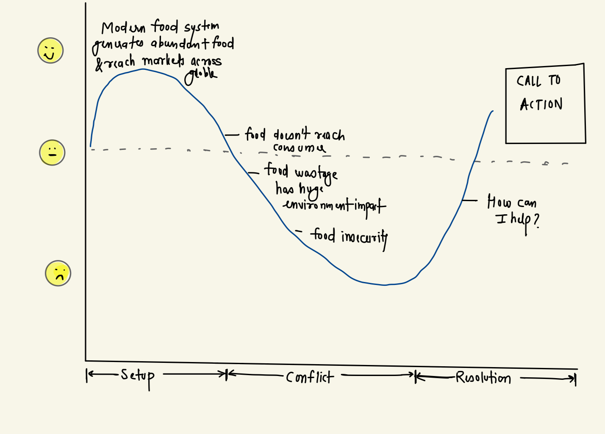
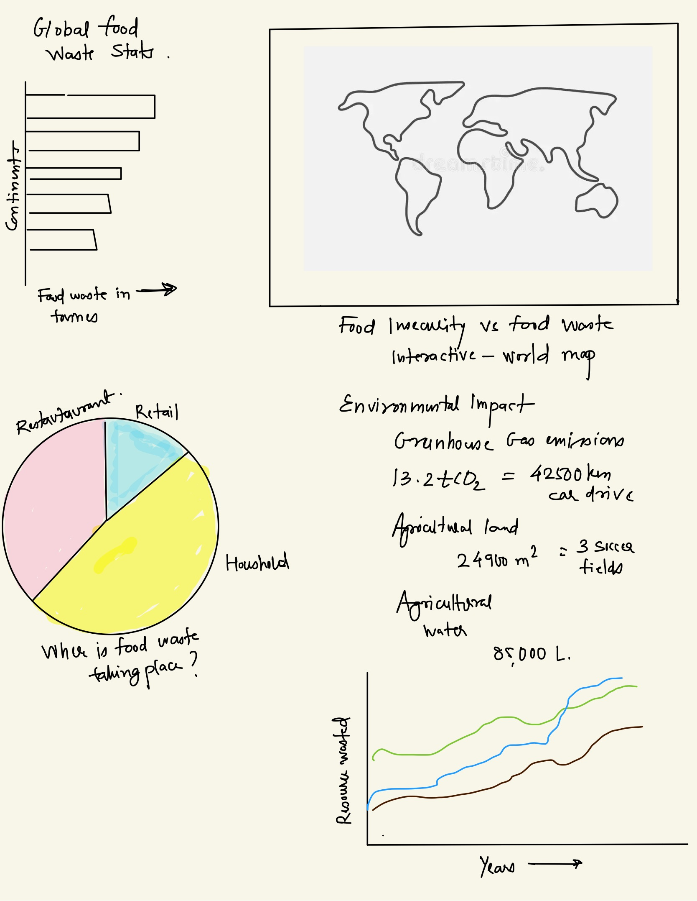

| [Home Page](https://sharvariyeole.github.io/portfolio) | [Visualizing Debt](visualizing-government-debt) | [Critique by Design](critique-by-design) | [Final Project I](final-project-part-one) | [Final Project II](final-project-part-two) | [Final Project III](final-project-part-three) |

# Topic: How to Turn the Tables on Food Waste: A Global Feast for Thought 

# Outline
### High Level Summary
The global food system can feed billions of people but also causes a lot of food waste. This waste harms the environment, costs a lot of money, and makes food scarcity worse. By understanding and dealing with the reasons behind food waste, we can develop better ways to consume food, reduce harm to the environment, and use resources more wisely.
 
### Reader's Objective
As a reader, I want to understand the scale of food wastage, its impacts, and practical ways to contribute to its reduction, aiming for a sustainable future. By learning about effective strategies for minimizing food waste at the individual, community, and policy levels, I can make informed decisions that contribute to a more efficient and ethical food system.

### Project Structure
Setup: The modern food system is a marvel of logistics and production, capable of generating abundant food supplies that reach markets across the globe, ensuring variety and availability like never before.

Conflict: Despite these advancements, a significant portion of this food never reaches consumers, leading to environmental, economic, and social issues. Food wastage occurs at multiple points in the supply chain, from agricultural production to household consumption, each contributing to the problem in unique ways.

Resolution: By adopting measures such as improving supply chain efficiencies, enforcing better food handling practices, educating consumers, and implementing innovative solutions to redistribute excess food, significant strides can be made in reducing food wastage. Personal actions like planning purchases, understanding food labels, and creative re-use of leftovers are also crucial steps toward this goal.

### Story Arc

### Setup: Introducing the Global Food Waste Challenge

- **Context and Magnitude of the Problem**: Begin by presenting the global scale of food waste, highlighting how a significant portion of food produced worldwide is never consumed. Introduce key statistics to illustrate the extent of food waste from production to consumption across various regions.
- **Underlying Causes**: Discuss the multi-faceted reasons behind food waste, including agricultural practices, supply chain inefficiencies, retail and restaurant waste, and consumer behavior. This part sets the stage by providing a broad understanding of how and why food waste occurs at different stages of the food system.
- **Environmental, Economic, and Social Impacts**: Briefly outline the consequences of food waste, including its contribution to greenhouse gas emissions, wasted resources (like water and land), economic losses for producers and consumers, and missed opportunities to address food insecurity.

### Conflict: The Challenges in Addressing Food Waste

- **Complexity of the Food Supply Chain**: Delve into the complexities of reducing food waste within the global food supply chain, from harvest and post-harvest losses in agricultural settings to issues in distribution, retail, and consumption.
- **Behavioral and Policy Barriers**: Explore the challenges related to changing consumer behavior, such as the tendency to overbuy and misunderstandings about food expiration dates, as well as the need for more supportive policies and infrastructure to facilitate food waste reduction.
- **Technological and Logistical Limitations**: Highlight the limitations in current technologies for food preservation, distribution, and recycling, as well as the logistical challenges in connecting surplus food with those in need.

### Resolution: Strategies and Solutions for Reducing Food Waste

- **Innovations and Best Practices**: Present innovative technologies, practices, and policies that have been successful in reducing food waste at different points in the food supply chain, such as precision farming, improved food storage solutions, food sharing platforms, and policies that encourage donation over disposal.
- **Community and Individual Actions**: Emphasize the role of communities and individuals in reducing food waste, including adopting more mindful consumption habits, participating in composting programs, and supporting initiatives that redistribute food to those in need.
- **Call to Action for Collective Effort**: Conclude with a strong call to action, urging stakeholders at all levels—from policymakers and industry leaders to consumers and communities—to collaborate in reducing food waste. Highlight the importance of education, policy change, and innovation in creating a more sustainable food system.

## Initial sketches

# The data
> A couple of paragraphs that document your data source(s), and an explanation of how you plan on using your data. 

Text here...

> A link to the publicly-accessible datasets you plan on using, or a link to a copy of the data you've uploaded to your Github repository, Box account or other publicly-accessible location. Using a datasource that is already publicly accessible is highly encouraged.  If you anticipate using a data source other than something that would be publicly available please talk to me first. 

| Name | URL | Description |
|------|-----|-------------|
|      |     |             |
|      |     |             |
|      |     |             |

# Method and medium
I plan to use the following tools for my final Project:
1. Tableau for vizualizations
2. Figma for wireframing
3. Shorthand for final story narrative
4. Canva to create any other custom visual
