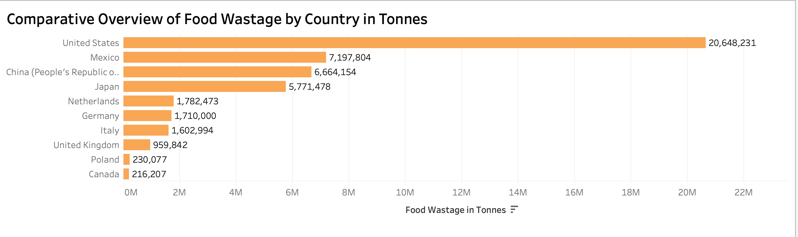
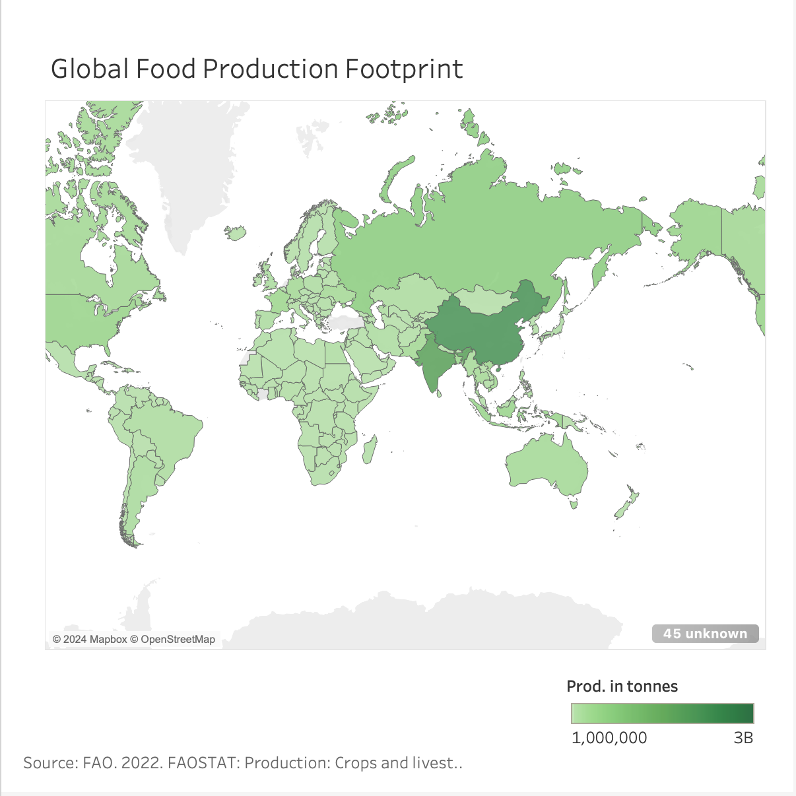
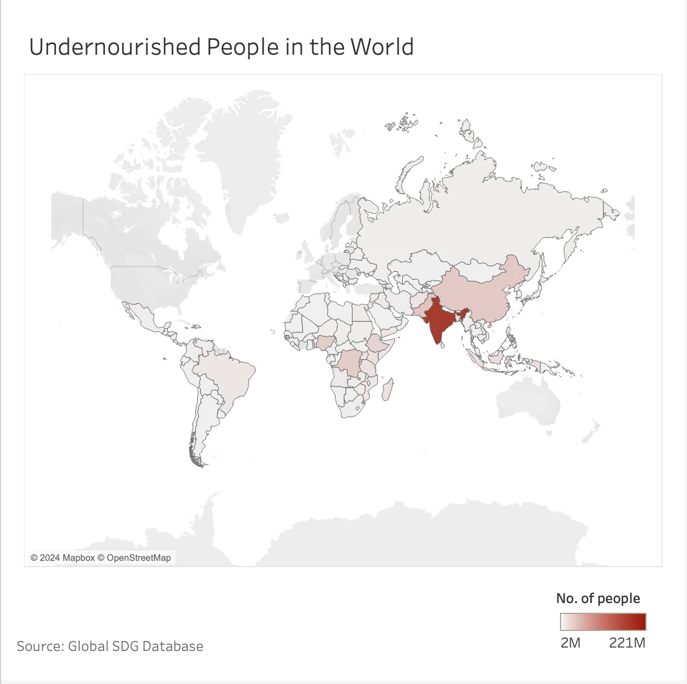
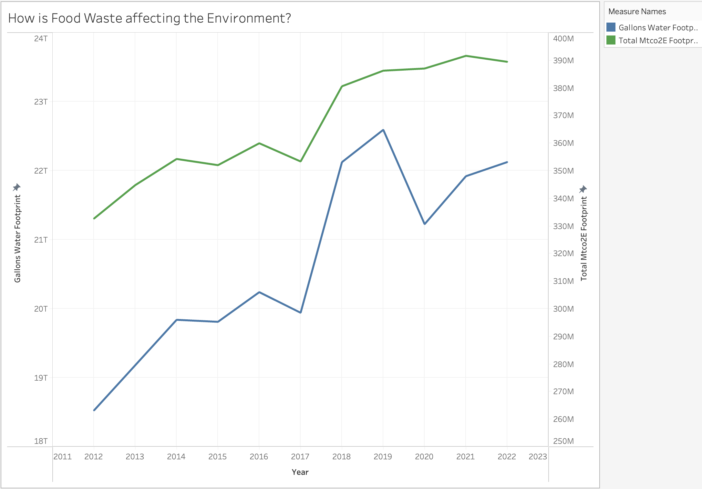
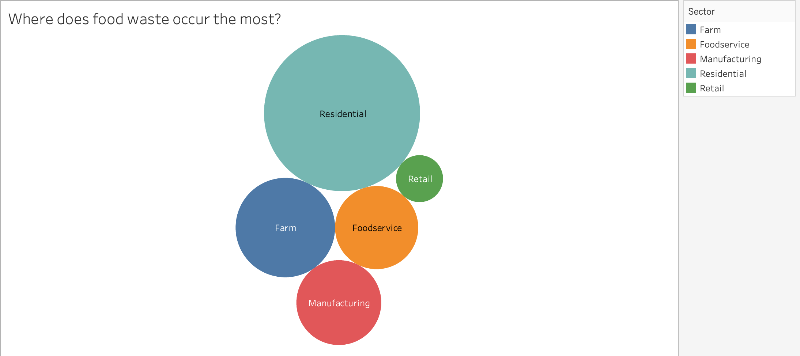
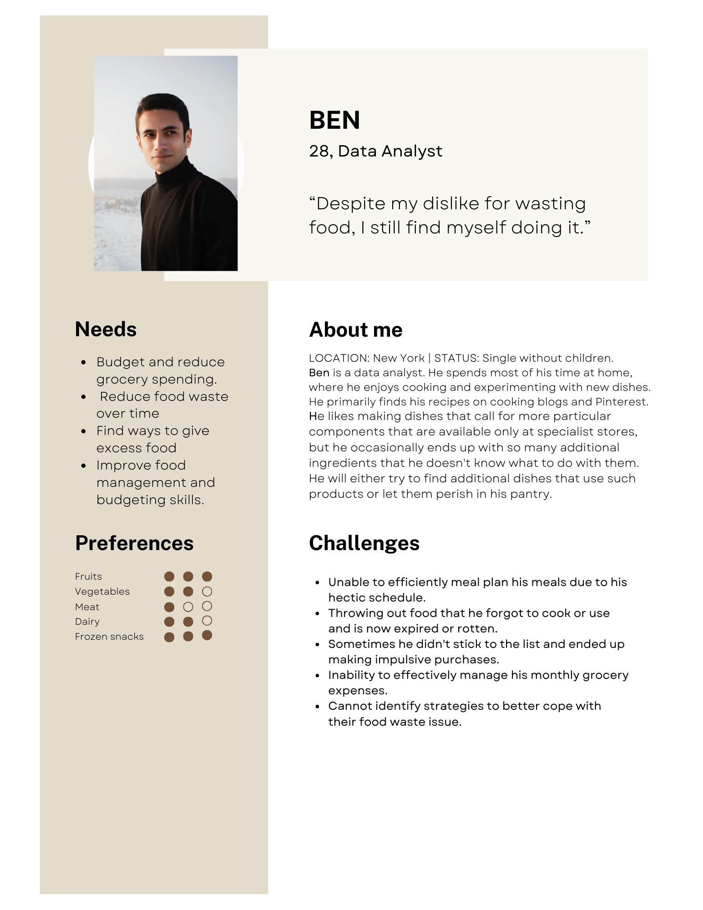
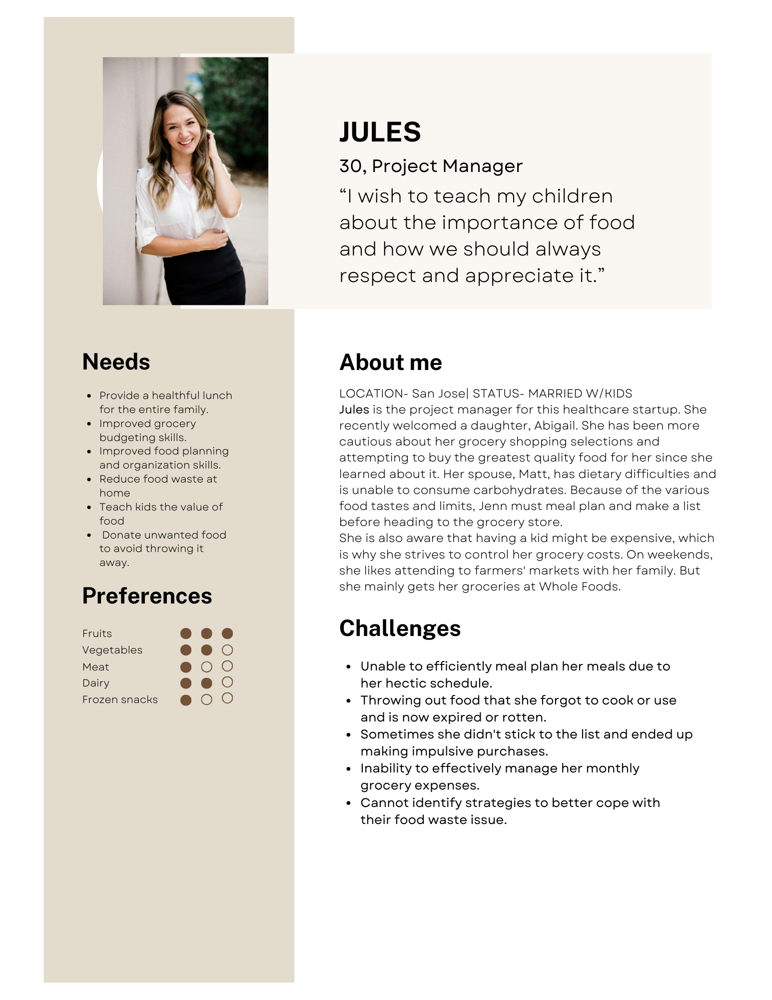
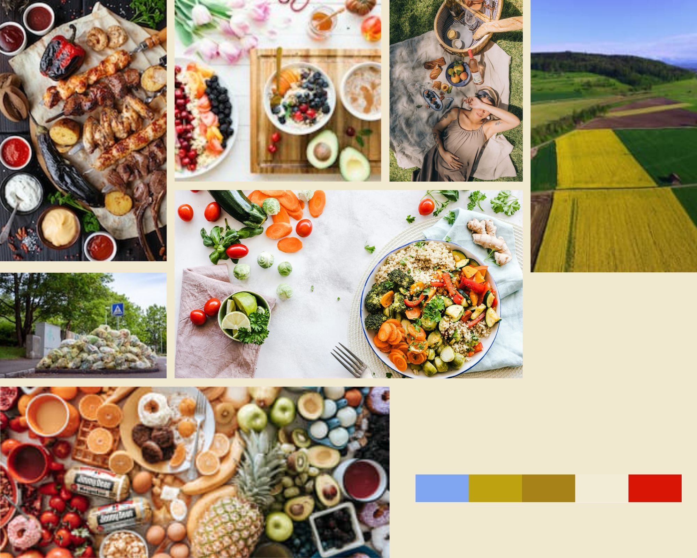

| [Home Page](https://sharvariyeole.github.io/portfolio) | [Visualizing Debt](visualizing-government-debt) | [Critique by Design](critique-by-design) | [Final Project I](final-project-part-one) | [Final project II](final-project-part-two) | [Final Project III](final-project-part-three) |

# Wireframes

  

# User research 

## Target audience

The food waste story is intended for the general public, with the goal of inspiring a cultural shift towards more sustainable food consumption and waste practices. It also involves policymakers, industry experts, and environmentalists, providing them with knowledge to promote systemic improvements. Educators are urged to pass this information on to students, resulting in a new generation of environmentally concerned citizens. In essence, this story is a call to action for everyone, emphasizing the importance of personal decisions in creating a future where food is valued and conserved.

## Interview Script

| Goal                              | Questions to Ask                                 |
|-----------------------------------|--------------------------------------------------|
| Understanding awareness           | Have you ever considered the amount of food waste you produce? |
| Identifying the target audience   | Who do you think should be most aware of the food waste issue? |
| Clarity of the information        | Was the information about food waste and its impact clear to you? |
| Key takeaways                     | What's your biggest takeaway from the food waste discussion? |
| Surprises and confusion           | Was there anything that surprised you or that you found confusing? |
| Effectiveness of visuals          | Did the visualizations help you understand the scale of food waste? |
| Emotional impact                  | How did the graphics make you feel about the issue? |
| Design effectiveness              | Do you think the colors and design of the visuals were effective? |
| Suggestions for improvement       | What would you change about the presentation or approach? |

## Interview Findings

| Questions                                            | Interview 1 (Household focus) | Interview 2 (Corporate focus) | Interview 3 (Government focus) |
|------------------------------------------------------|--------------------------------|-------------------------------|---------------------------------|
| Consideration of food waste production               | Rarely considered before       | Aware but not actively engaged | Confronted by visualization     |
| Intended audience for food waste awareness           | Households and schools         | Corporate boardrooms           | Government offices              |
| Clarity of food waste impact                         | Information was clear          | Data was straightforward       | Visual data was easy to follow  |
| Main takeaway from food waste data                   | Residential waste is significant| Disparity in waste generation  | High waste despite less population|
| Surprises or confusions                              | Retail sector's waste volume   | Manufacturing's contribution   | Hunger amidst waste             |
| Helpfulness of charts                                | Very helpful                   | Extremely useful               | Direct look at discrepancies    |
| Emotional impact of visuals                          | Struck by residential waste    | Shocked by corporate waste     | Impact of hunger map            |
| Effectiveness of design                              | Colors matched sectors well    | Design highlighted key points  | Map showed hunger clearly       |
| Changes or improvements                              | Add actionable tips            | Include interactive elements   | Suggest solutions for change    |

# Identified Changes for Part III
> Document the changes you plan on implementing next week to address any issues identified.

| Research Synthesis                             | Anticipated Changes for Part III                                           |
|------------------------------------------------|----------------------------------------------------------------------------|
| Lack of prior consideration of food waste      | Introduce educational content to increase awareness.                       |
| Need for broader audience engagement           | Expand outreach to include interactive sessions for corporations and government agencies. |
| Surprise at the scale of the issue             | Enhance visuals to better convey the magnitude of waste in different sectors. |
| Discrepancy in waste vs. hunger                | Add comparative visualizations showing food waste alongside hunger data.   |
| Suggestions for improving visuals              | Implement interactive elements like clickable charts for detailed data.    |

> Moving forward, the focus will be on creating more interactive and educational materials to deepen the understanding of food waste's impact and drive meaningful changes across all audience segments.

# Moodboards / Personas

  

